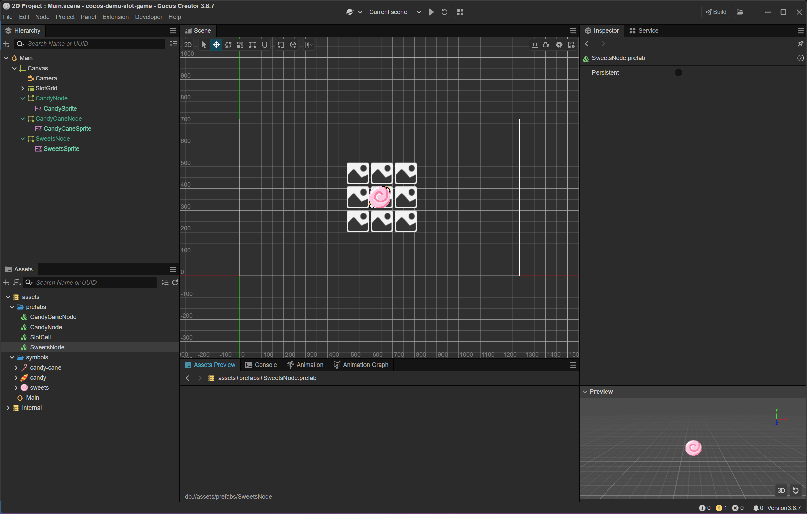

## Thêm biểu tượng kẹo

### Chuẩn bị hình ảnh kẹo

```
- Hình ảnh kẹo
    - ./assets/photos/icons/candy-cane.png
    - ./assets/photos/icons/candy.png
    - ./assets/photos/icons/sweets.png
- Tìm và tải các hình ảnh PNG kẹo (nền trong suốt) từ các nguồn miễn phí như:
    - https://www.flaticon.com/
    - https://www.freepik.com/
    - https://opengameart.org/
- Kéo các file ảnh vào thư mục assets/symbols/ trong Cocos Creator
```


### Tạo Prefab cho từng biểu tượng

#### Tạo Node

```
- Trong cửa sổ Hierarchy, chuột phải vào Canvas > Create > Empty Node
- Đặt tên node mới là CandyNode
- Chọn node CandyNode → trong Inspector, chỉnh: 
    - Anchor: (0.5, 0.5)
    - ContentSize: 100 x 100
```

#### Thêm Sprite

```
- Chuột phải vào CandyNode > Create > 2D Object > Sprite
- Đặt tên là CandySprite
- Chọn node CandySprite → trong Inspector: 
    - Anchor: (0.5, 0.5)
    - Position: (0, 0)
    - ContentSize: 100 x 100
    - Type: Simple
    - Sprite Frame: chọn >candy>
```

#### Tạo Prefab

```
- Trong cửa sổ Hierarchy, kéo node CandyNode vào thư mục assets/prefabs
- Cocos Creator sẽ tạo một Prefab CandyNode.prefab
```

> Sau khi tạo prefab xong có thể xóa các node icon đi không cần giữ lại

```
- Lặp lại các bước để tạo prefabe cho các icon còn lại
- Và ta đã có 3 prefab tương ứng cho 3 icon
```


