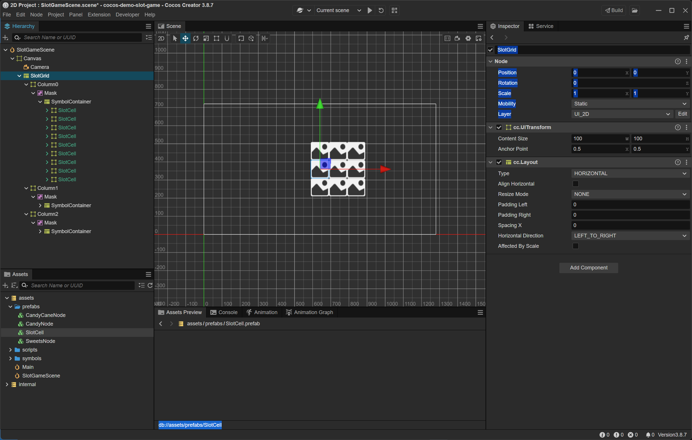

#### Tạo SlotGrid và Mask theo cấu trúc như sau

```
SlotGrid (Horizontal Layout)
├── Column0 (Node)
│   └── Mask (Rect)
│       └── SymbolContainer (Vertical Layout)
│           ├── Symbol1
│           ├── Symbol2
│           ├── Symbol3 ← hiển thị
│           ├── Symbol4 ← hiển thị
│           ├── Symbol5 ← hiển thị
│           ├── Symbol6
│           └── Symbol7
├── Column1
├── Column2
```

#### Thiết lập từng phần

##### Tạo node SlotGrid và gắn layout

Right click Canvas > Create > Empty Node
- Name: SlotGrid

Add Component > Create > UI > Layout
- Type: HORIZONTAL
- Resize Mode: None
- Horizontal Direction: LEFT_TO_RIGHT

##### Tạo node ColumnX

Right click SlotGrid > Create > Empty Node
- Name: ColumnX
- Content Size: width = 100, height = 300 (3 biểu tượng × 100px)
- Không cần Layout

##### Tạo Mask

Right click ColumnX > Create > 2D Object > Mask
- Name: Mask
- Type: GRAPHICS_RECT
- Content Size: width = 100, height = 300

##### Tạo SymbolContainer và gắn layout

Right click Mask > Create > Empty Node
- Name: SymbolContainer

Add Component > UI > Layout
  - Type: VERTICAL
  - Resize Mode: CONTAINER
  - Vertical Direction: TOP_TO_BOTTOM

##### Thêm symbol vào SymbolContainer

- Kéo prefabs/SlotCell (đã tạo ở demo trước) vào SymbolContainer
- Kéo 9 symbol vào

> Làm tương tự cho các column còn lại hoặc duplicate Column0



#### Tạo ScoreLabel và SpinButton

Làm như demo slot game

***
[Back](index.md)
