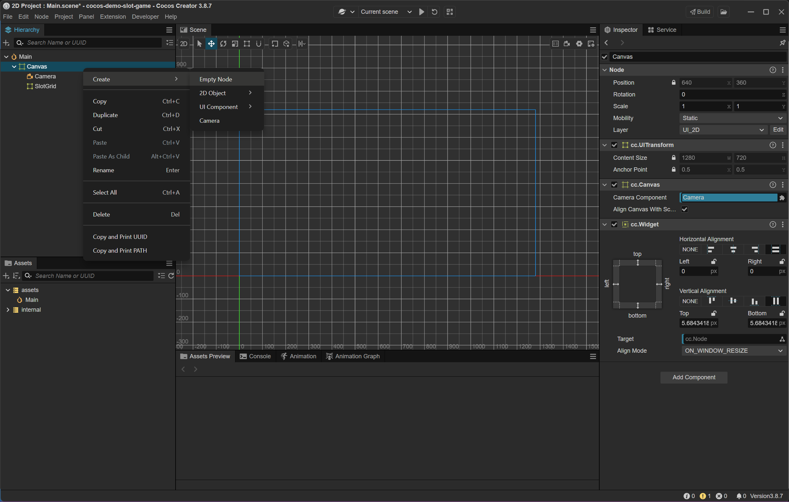
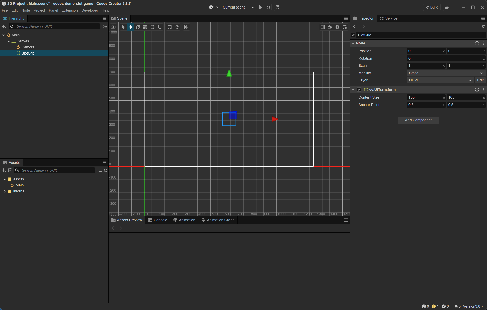
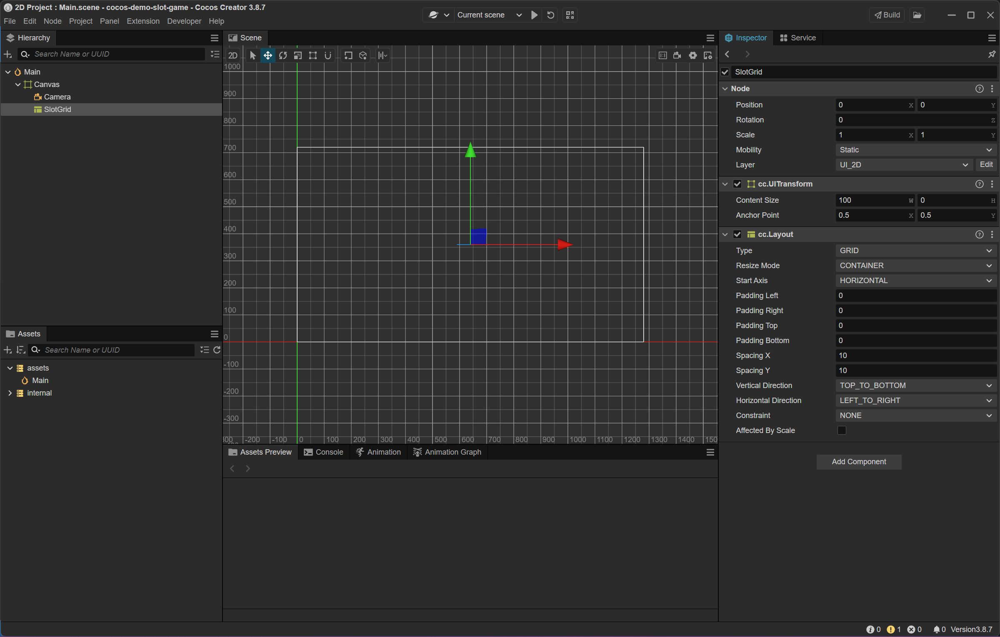
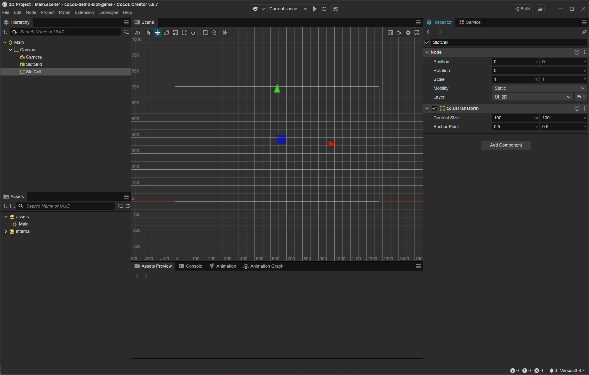
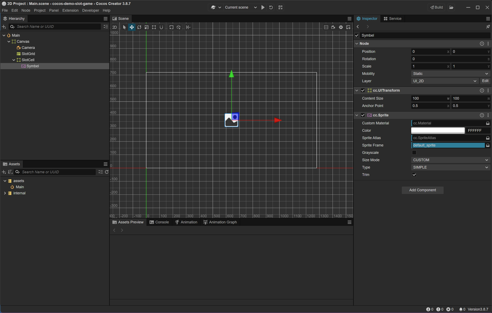
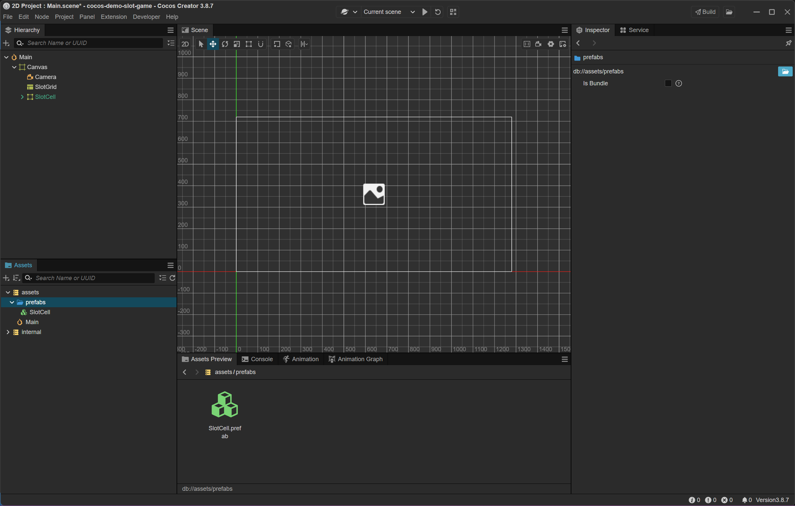
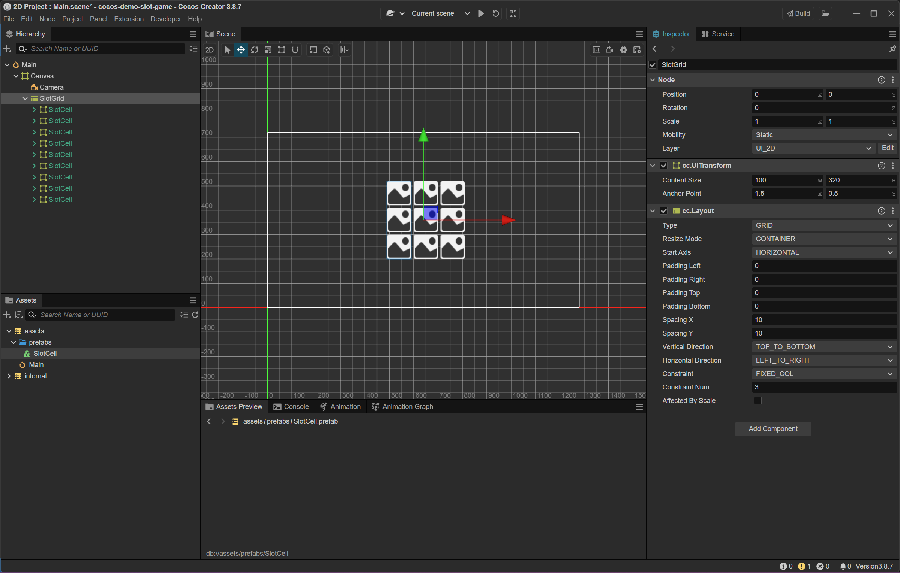

### 📑 Table of Contents

- [📘 Tạo node `SlotGrid`](#-tạo-node-slotgrid)
- [📘 Tạo prefab `SlotCell`](#-tạo-prefab-slotcell)

***

#### 📘 Tạo node `SlotGrid`

##### 🧱 Tạo node

Right click Canvas > Create > Empty Node
- `Name`: `SlotGrid`
- `Anchor Point` : 1.5 : 0.5 (canh giữa màn hinh)
- `Position` : (0, 0)

##### 🧱 Add component

> Thêm Layout cho `SlotGrid` vừa tạo

Chọn node `SlotGrid` > Inspector >
Add Component > UI > Layout
- `Type` : GRID
- `Resize Mode` : CONTAINER
- `Start Axis` : HORIZONTAL
- `Vertical Direction` : TOP_TO_BOTTOM
- `Horizontal Direction` : LEFT_TO_RIGHT
- `Spacing X` : 10, `Spacing Y` : 10 (khoảng cách giữa ô)

> Layout sẽ tự động sắp xếp các ô thành lưới 3x3

***

#### 📘 Tạo prefab `SlotCell`

##### 🧱 Tạo Node

> Tạo node `SlotCell`

Hierarchy >
Right click Canvas > Create > Empty Node
- `Name` : `SlotCell`
- `Anchor Point` : (0.5, 0.5)
- `Content Size` : 100 x 100 (hoặc kích thước bạn muốn cho ô slot)

##### 🧱 Tạo Sprite

> Thêm Sprite vào SlotCell để hiển thị biểu tượng

Right click `SlotCell` >
Create > 2D Object > Sprite 
- `Name` : `Symbol`

Chọn node `Symbol` > Inspector
- `Anchor Point` : (0.5, 0.5)
- `Position` : (0, 0)
- `ContentSize` : 100 x 100
- `Type` : Simple
- `Sprite Frame` : để trống (sẽ gán bằng code sau)

> Đây là nơi bạn sẽ gán hình ảnh kẹo khi quay slot

##### 🧱 Tạo Prefab

> Tạo prefab `SlotCell`

- Tạo thư mục `assets/prefabs` (nếu chưa có)
- Trong cửa sổ Hierarchy, kéo node `SlotCell` vào thư mục assets/prefabs
- Cocos Creator sẽ tạo một Prefab `SlotCell.prefab`

> 📌 **Note**  
> Xoá node `SlotCell` khỏi scene nếu không cần giữ lại

***

##### 📖 Sử dụng prefab `SlotCell`

- Kéo `SlotCell.prefab` vào node `SlotGrid` nhiều lần (ví dụ: 9 lần cho lưới 3x3)
- Các ô sẽ tự động sắp xếp nếu `SlotGrid` có Layout Component

##### 📖 Chỉnh `SlotGrid`

Chọn node `SlotGrid` > Inspector > Layout
- `Constraint` : FIXED_COL
- `Constraint Num` : 3
- `Anchor Point` : 1.5 : 0.5 (canh giữa màn hinh)

***

🔙 [Back](index.md)
