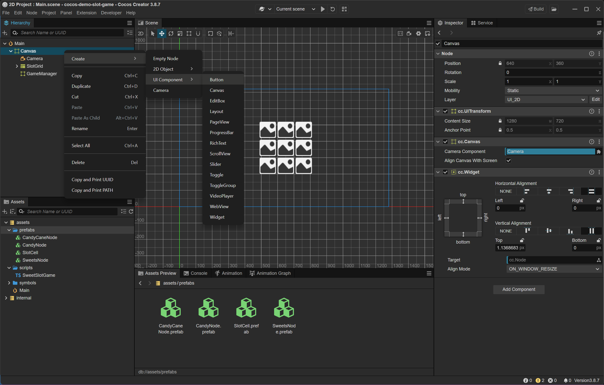
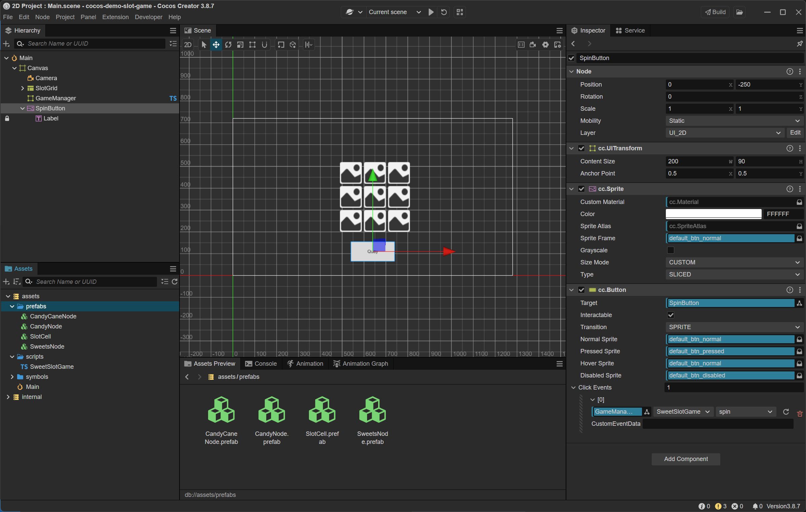

### 📑 Table of Contents

- [📘 Tạo SpinButton](#-tạo-spinbutton)

***

#### 📘 Tạo SpinButton

Tạo SpinButton và kết nối sự kiện click

##### 🧱 Tạo Button

Right click Canvas >
Create > UI Component > Button
- `Name` : `SpinButton`

Trong node `SpinButton`, bạn sẽ thấy có một Label con, đổi nội dung thành “Quay”

Chọn node `SpintButton/Label` > Inspector > component Label
- `string` : Quay
- Chỉnh Position của `SpinButton` đặt dưới khung slot (ví dụ: (0, -250))

##### 📖 Kết nối sự kiện Click

Chọn node SpinButton trong Hierarchy >
Trong Inspector > component Button > Click Events > Thêm 1 event

Array [0]
- `Target`: Kéo node GameManager vào đây
- `Component`: Chọn SweetSlotGame
- `Handler` : Chọn hàm spin

> 📌 **Note**  
> Nếu bạn không thấy SweetSlotGame hoặc spin, hãy đảm bảo:
> - Script đã được gắn vào node GameManager
> - Hàm spin() được khai báo là public trong script

***

🔙 [Back](index.md)
