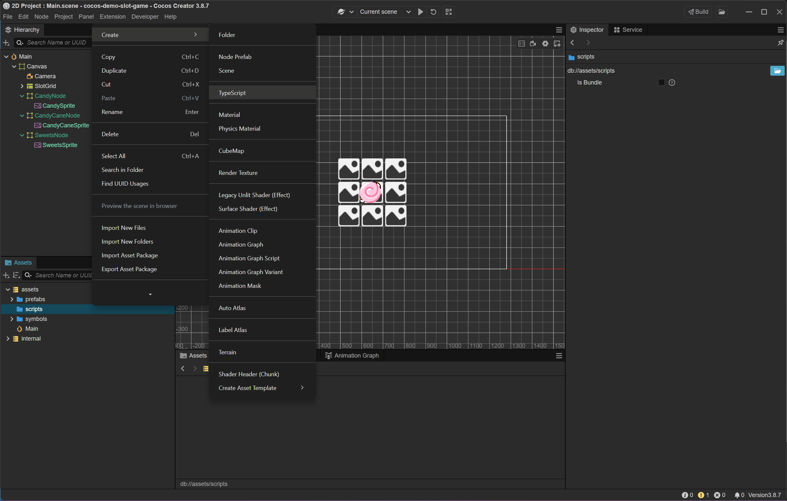
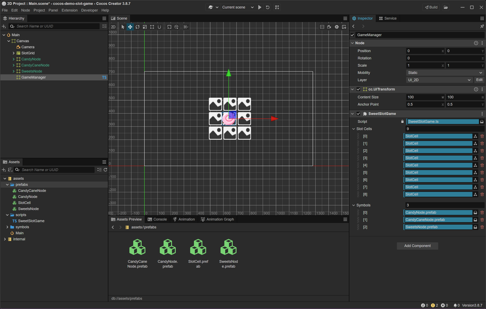

## Tạo script SweetSlotGame

### Tạo script

```
- Trong cửa sổ Assets, chuột phải vào thư mục assets/scripts (hoặc tạo thư mục mới nếu chưa có)
- Chọn Create → TypeScript
- Đặt tên file là SweetSlotGame.ts
```



### Viết script

Mở file SweetSlotGame.ts → thêm nội dung sau:

```Typescript
import { _decorator, Component, Node, Prefab, instantiate } from 'cc';
const { ccclass, property } = _decorator;
@ccclass('SweetSlotGame')
export class SweetSlotGame extends Component {
@property([Node])
    slotCells: Node[] = [];
@property([Prefab])
    symbols: Prefab[] = [];
spin() {
        for (let i = 0; i < this.slotCells.length; i++) {
            const randomIndex = Math.floor(Math.random() * this.symbols.length);
            const symbol = instantiate(this.symbols[randomIndex]);
const cell = this.slotCells[i];
            cell.removeAllChildren(); // Xoá biểu tượng cũ
            cell.addChild(symbol);    // Thêm biểu tượng mới
        }
    }
}
```

### Gắn script vào node quản lý

```
- Trong Hierarchy, tạo một node mới → đặt tên là GameManager
- Chọn node GameManager → nhấn Add Component → Custom Script → SweetSlotGame
    - Trong Inspector, bạn sẽ thấy: 
        - slotCells: mảng các ô slot
        - symbols: mảng các Prefab biểu tượng kẹo
```

### Gán dữ liệu vào script

```
- Gán slotCells
    • Kéo từng ô SlotCell trong SlotGrid vào mảng slotCells
    • Theo thứ tự từ trái sang phải, trên xuống dưới
- Gán symbols
    • Kéo các Prefab biểu tượng kẹo vào mảng symbols
```



***

[Back](index.md)
