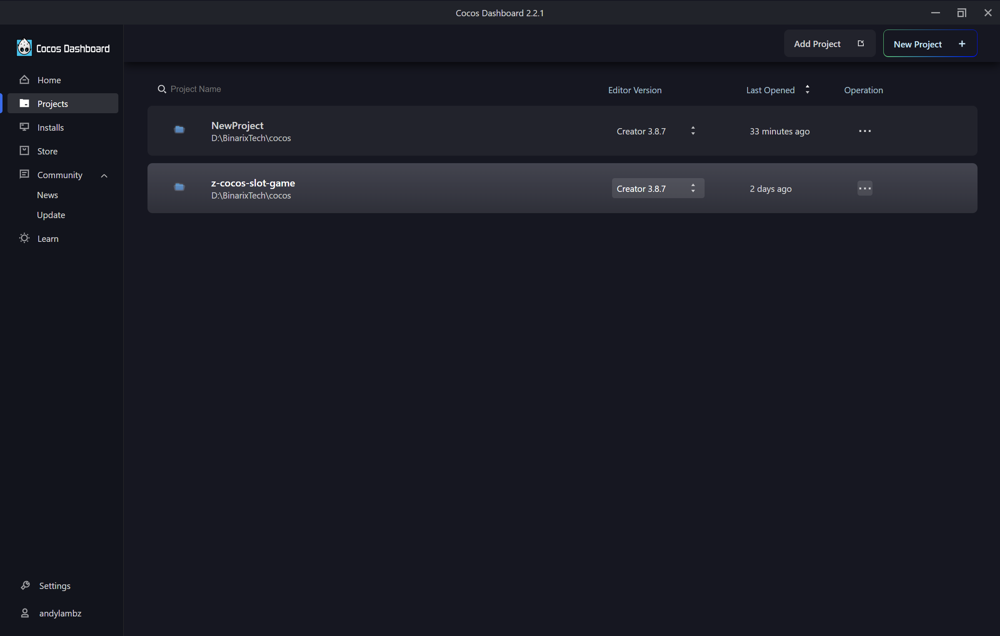
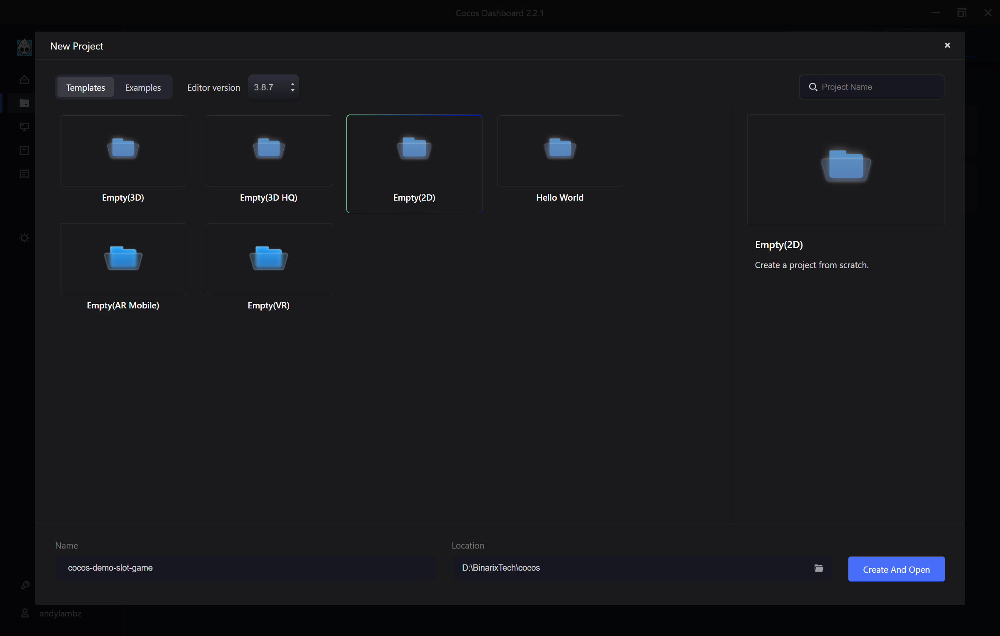
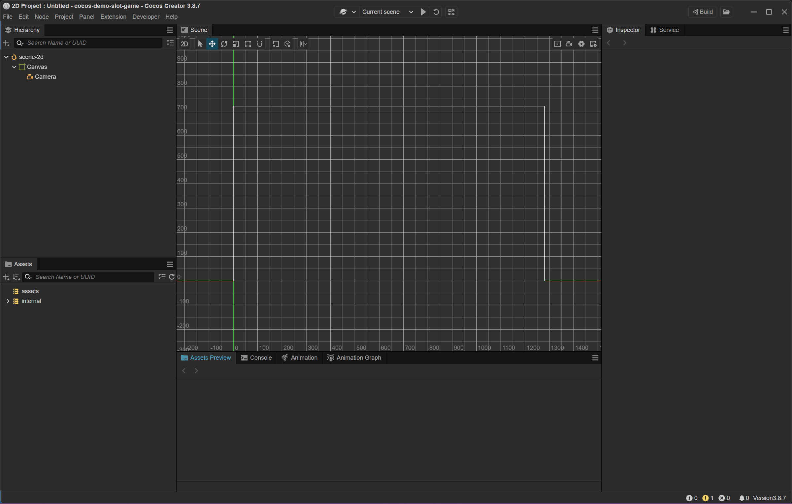
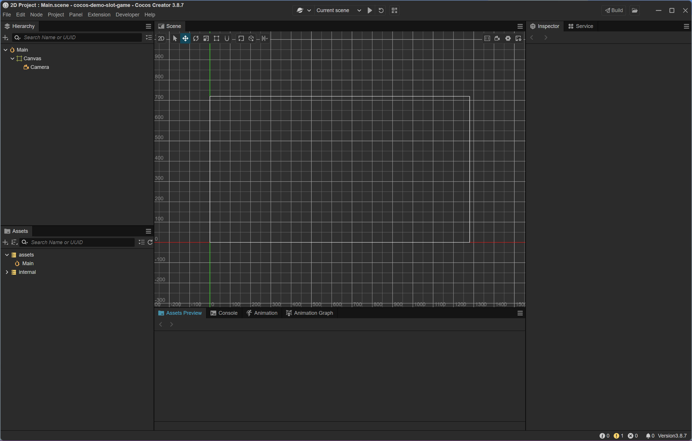

### 📑 Table of Contents

- [📘 Tạo project mới](#-tạo-project-mới)
- [📘 Tạo scene chính](#-tạo-scene-chính)

***

#### 📘 Tạo project mới

> Tạo project đầu tiên `cocos-demo-slot-game`

##### 🧱 Tạo project

Open Cocos Dashboard
Chọn Projects > New Project > Templates > Empty(2D) > Create And Open
- `Name`: Đặt tên cho project `cocos-demo-slot-game`
- `Location`: Chọn thư mục chứa project

***

#### 📘 Tạo scene chính

> Tạo một scene là `Main.scene`

##### 🧱 Tạo scene

1. Bấm Ctrl + s or File > Save Scene
2. Đặt tên `Main.scene`
3. Save

***

🔙 [Back](index.md)
