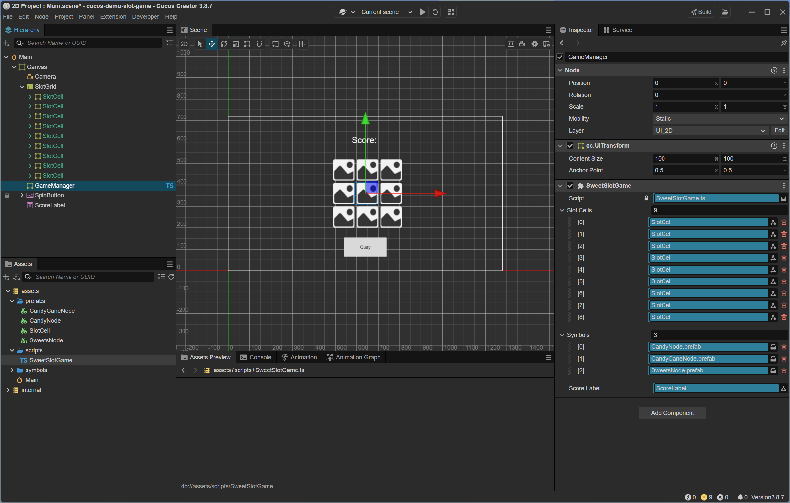
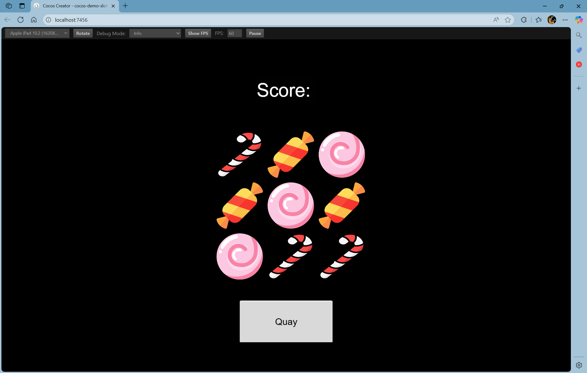

## Tính điểm

```
- Bắt đầu có 0 điểm
- Nếu hàng giữa có 3 hình giống nhau cộng 10 điểm
```

### Thêm Node ScoreLabel

```
- Trong Hierarchy > Right click Canvas > Create > 2D Object > Label
    - Name: ScoreLabel
- Chọn node ScoreLabel > component Label
    - Position: 0 : 250
    - string: "Kết quả:"
    - Font Size: 40
```

### Viết script

Open file SweetSlotGame.ts

```Typescript
import { _decorator, Component, Node, Prefab, instantiate, Label } from 'cc';
const { ccclass, property } = _decorator;

@ccclass('SweetSlotGame')
export class SweetSlotGame extends Component {
    @property([Node])
    slotCells: Node[] = [];
    @property([Prefab])
    symbols: Prefab[] = [];

    @property(Node)
    scoreLabel: Node = null;
    private score: number = 0;

    spin() {
        for (let i = 0; i < this.slotCells.length; i++) {
            const randomIndex = Math.floor(Math.random() * this.symbols.length);
            const symbol = instantiate(this.symbols[randomIndex]);
            const cell = this.slotCells[i];
            cell.removeAllChildren(); // Xoá biểu tượng cũ
            cell.addChild(symbol);    // Thêm biểu tượng mới
            symbol.name = `symbol_${randomIndex}`; // Đặt tên cho biểu tượng
        }
        this.checkWin();
    }

    checkWin() {
        // Lấy tên biểu tượng ở hàng giữa của mỗi cột
        const midRow = [
            this.slotCells[3].children[0]?.name,
            this.slotCells[4].children[0]?.name,
            this.slotCells[5].children[0]?.name,
        ];
        console.log('Mid Row Symbols:', midRow);
        if (midRow[0] && midRow[0] === midRow[1] && midRow[1] === midRow[2]) {
            this.score += 10;
            this.updateScoreLabel();
        }
    }

    updateScoreLabel() {
        const labelComp = this.scoreLabel.getComponent(Label);
        if (labelComp) {
            labelComp.string = `Score: ${this.score}`;
        }
    }
}
```

### Gán ScoreLabel vào GameManager

```
- Chọn node GameManager > Component SweetSlotGame
    - Score Label: kéo node ScoreLabel vào (map node ScoreLabel và biến tương ứng)
```

### Run





***

[Back](index.md)
