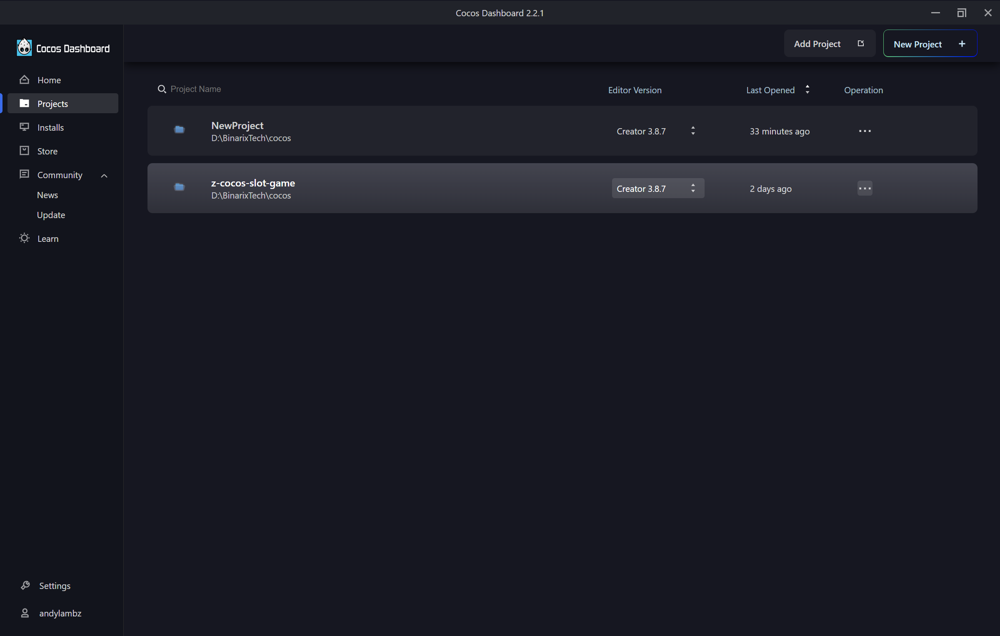

## Tạo project `cocos-demo-slot-game`

```
1. Open Cocos Dashboard
2. CHọn Projects > New Project > Templates > Empty(2D) > Create And Open
```

> `Name`: Đặt tên cho project `cocos-demo-slot-game`

> `Location`: Chọn thư mục chứa project




## Tạo Main.scene
```
1. Bấm Ctrl + s or File > Save Scene
2. Đặt tên Main.scene
3. Save
```


